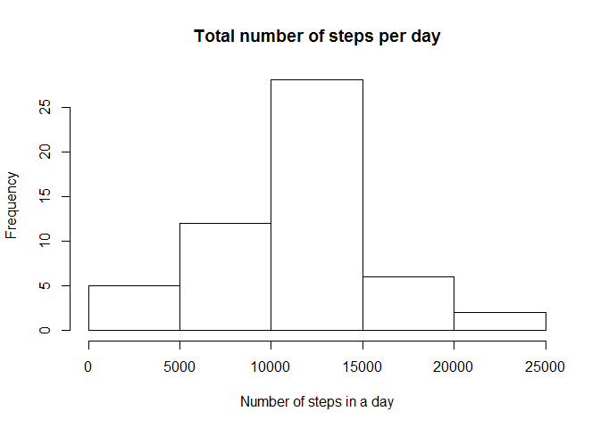
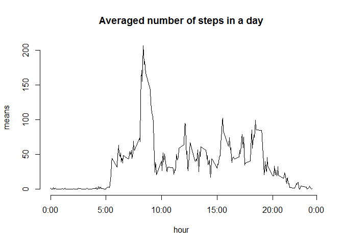
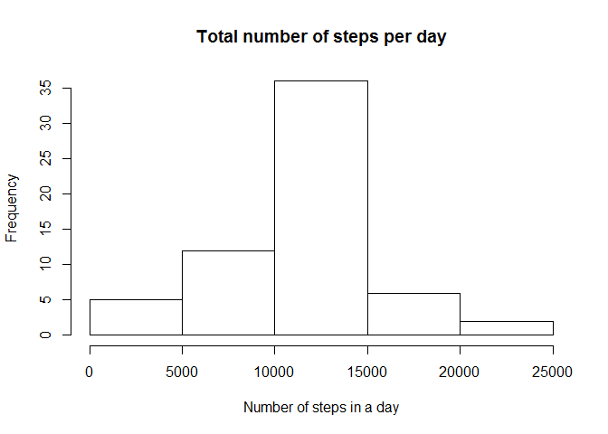

# Analysing Data from a Personal Activity Monitoring Device
Francesca Tantardini  
15 June 2017  


## Introduction

In this project, we analyse some data collected via a personal activity monitoring device. As described on the assignment page, the data are collected during the months of October and November 2012 and include the number of steps taken in 5 minute intervals each day.
The variables included in this dataset are:

- steps: Number of steps taking in a 5-minute interval (missing values are coded as 
NA)
- date: The date on which the measurement was taken in YYYY-MM-DD format
- interval: Identifier for the 5-minute interval in which measurement was taken


The dataset is stored in a comma-separated-value (CSV) file and there are a total of 17,568 observations in this dataset.


## Loading and preprocessing the data 
Assuming the data has been downloaded and saved in the working directory, we start by loading the data into R and convert the variable **date** to objects of class **Date**. 

```r
Sys.setlocale("LC_TIME", "C")
my_data<-read.csv("activity.csv", header=TRUE)
my_data$date<-as.Date(my_data$date)
```

## What is the mean of the total number of steps taken per day?
As allowed, for this part we ignore the missing values in the dataset. We calculate the total number of steps per day, using the functions **group_by** and **summarise** in the **dplyr** package and make a histogram of the total number of steps taken each day.

```r
library(dplyr)
my_data_date<-filter(my_data, !is.na(steps))%>% group_by(date)
sum_steps<-summarise(my_data_date, sums=sum(steps))
hist(sum_steps$sums, main="Total number of steps per day", xlab="Number of steps in a day")
```

<!-- -->

```r
M<-mean(sum_steps$sums)
Med<-median(sum_steps$sums)
options("scipen"=10)
```
The mean and median of the numbers of steps taken per day are respectively ``10766.1886792`` and ``10765``. 

## What is the average daily activity pattern?

In order to make a time series plot of the 5-minute interval (x-axis) and the average number of steps taken, averaged across all days (y-axis), we group the data by the interval variable and take the mean of the number of steps.  

```r
my_data_interval<-filter(my_data, !is.na(steps)) %>% group_by(interval)
mean_steps<-summarise(my_data_interval, means=mean(steps))
with(mean_steps, plot(interval, means, 'l', main="Averaged number of steps in a day", xlab="hour", axes=FALSE))
axis(1, at=c(0, 500, 1000, 1500, 2000, 2400),labels=c("0:00", "5:00", "10:00", "15:00", "20:00", "0:00"))
axis(2)
```

<!-- -->

```r
InterMax<-mean_steps[which.max(mean_steps$means), 1]
zeros<-paste0(rep(0,4-nchar(InterMax)),collapse="")
InterMax<-paste(zeros, InterMax, sep="")
InterMax<-paste(substr(InterMax, 1, 2), substr(InterMax, 3, 4),sep=":")
```
The 5 minute interval with the higher average of steps is 
``08:35``. 

## Imputing missing values
We first calculate the number of missing value in the dataset

```r
NumNA<-sum(is.na(my_data))
```
obtaining that there are ``2304`` missing values.

In order to fill them in, we use the mean for that 5-minute interval, which is stored in the dataset **mean_steps**, and we save the new dataset in the variable **new_data**. 


```r
new_data<-my_data
for (i in 1:dim(new_data)[1]){
if (is.na(new_data$steps[i])){
    time<-new_data$interval[i]
new_data$steps[i]<-as.numeric(mean_steps[mean_steps$interval==time,2])
}
}
```
Using the same instruction as above, but applied to **new_data**, we 
make a histogram of the total number of steps taken each day and calculate the mean and median total number of steps taken per day. 

```r
new_data2<-group_by(new_data, date)
sums<-summarise(new_data2, sums=sum(steps))
hist(sums$sums, main="Total number of steps per day", xlab="Number of steps in a day")
```

<!-- -->

```r
M2<-mean(sums$sums)
Med2<-median(sums$sums)
```
They are respectively ``10766.1886792`` and ``10766.1886792`` . With respect to the values when the missing data are omitted, we see that the mean does not change and the median gets equal to the mean. 

## Are there differences in activity patterns between weekdays and weekends?

We first create a new factor variable **day** in the dataset, with two levels **weekday** or **weekend** indicating whether a given date is a weekday or weekend day. 
Then we group the data first by day and then by interval, in order to make a  panel plot containing a time series plot of the average number of steps taken. 


```r
new_data<-mutate(new_data, day=as.factor(ifelse (weekdays(date) %in% c("Saturday", "Sunday"), "weekend", "weekday")))%>%group_by(day, interval)
means<-summarise(new_data, means=mean(steps))
par(mfcol=c(2,1))
with(filter(means, day=="weekday"), plot(interval, means, 'l', main="Nr of steps on weekdays", axes=FALSE, xlab="hour"))
axis(1, at=c(0, 500, 1000, 1500, 2000, 2400),labels=c("0:00", "5:00", "10:00", "15:00", "20:00", "0:00"))
axis(2)
with(filter(means, day=="weekend"), plot(interval, means, 'l', main="Nr of steps on weekend days", axes=FALSE, xlab="hour"))
axis(1, at=c(0, 500, 1000, 1500, 2000, 2400),labels=c("0:00", "5:00", "10:00", "15:00", "20:00", "0:00"))
axis(2)
```

<!-- -->
